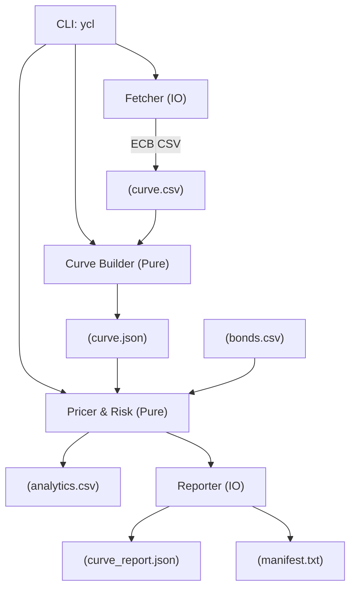
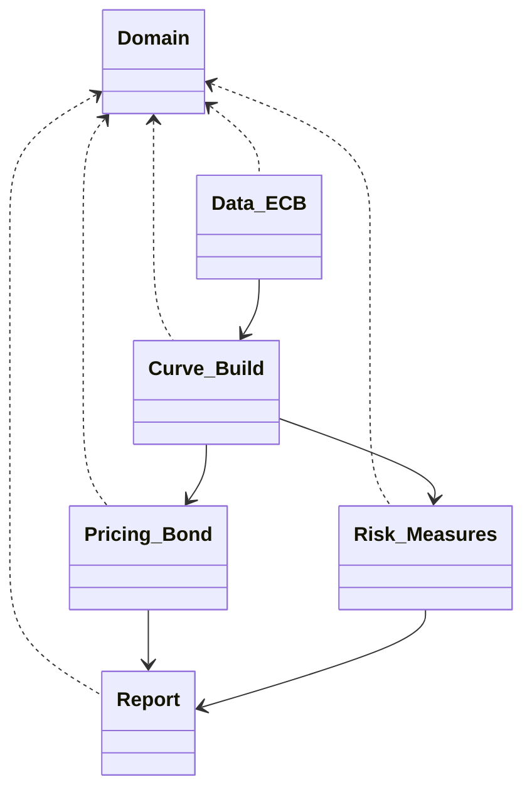

# YieldCurveLab

YieldCurveLab is a Haskell-powered toolkit that ingests public zero-coupon curves, builds a deterministic discount surface, prices fixed-rate bullet bonds, and computes DV01 plus key-rate DV01s with reproducible artifacts. It follows a pure-core/IO-edge design so you can audit every step from raw CSV data to the final analytics table.

## What it delivers:

- **Deterministic Curve Engine** – Ingests ECB zero-coupon spot rates and builds a log-discount-factor interpolated curve with flat-forward extrapolation. Validation checks (monotonicity, DF bounds, negative forward share) are emitted in both JSON and manifest form, giving you an audit trail that a compliance officer would accept.

- **Bond Pricing & Risk Analytics** – Turns a simple CSV of bonds into pricing and risk metrics: clean/dirty price, accrued interest, Macaulay/modified duration, convexity, total DV01, and the 2/5/10/30 key-rate DV01 decomposition. These are the numbers a fixed-income desk needs for hedging decisions, P&L attribution, and risk reporting.

- **CLI-Driven Workflow** – A `ycl` command-line tool orchestrates the whole pipeline (`fetch`, `build`, `price`). All outputs land in `out/`, each accompanied by a manifest that hashes the inputs (curve CSV, bond list) and records assumptions. You can hand these artifacts to another team knowing they can rebuild and verify the exact same results.

- **Golden Regression Tests** – Beyond unit specs, the project ships with a golden test that runs the entire pipeline in-process and compares the generated analytics to a committed reference. If any change alters pricing or risk outputs, you’ll know immediately.

## Quick Start (macOS/Linux)

1. Install GHC 9.6.7 and cabal (e.g. via [ghcup](https://www.haskell.org/ghcup/)).
2. Clone this repo, then run:
   ```bash
   cd scripts
   uv sync
   uv run build_curve_csv.py --date {TARGETDATE} --output {../OUTPUTFOLDER/OUTPUTNAME}
   uv run generate_bonds_csv.py --settle {TARGETDATE} --output {OUTPUTFOLDER/OUTPUTNAME}
   cabal update
   cabal build
   cabal test
   ```
3. Generate the sample pipeline:
   ```bash
   cabal run ycl -- fetch --date 2025-10-02 --out data/ecb_2025-10-02.csv
   cabal run ycl -- build --curve data/ecb_2025-10-02.csv --out out/curve.json --report out/curve_report.json
   cabal run ycl -- price --curve out/curve.json --bonds input/bonds.csv --out out/analytics.csv --manifest out/manifest.txt
   ```
   Outputs land under `out/` and match `test/golden/analytics_expected.csv`.

## CLI Overview

- `ycl fetch` – offline stub that copies the bundled ECB curve into place so you can work without network access.
- `ycl build` – parses the curve CSV, builds the log-DF interpolated curve, and emits both `out/curve.json` and `out/curve_report.json` with validation metrics.
- `ycl price` – loads a curve JSON plus a bonds CSV, prices each instrument, computes DV01 / KRD / durations / convexity, and writes `out/analytics.csv` alongside a manifest (`manifest.txt`) that captures hashes and metadata.

## Architecture





## Assumptions

- Data source: ECB zero-coupon spot curve for the Euro area, treated as continuously compounded.
- Day count: ACT/365, annual coupon frequency (MVP); bonds at other frequencies are rejected.
- Interpolation: piecewise linear in log-discount factors with flat-forward extrapolation.
- CLI outputs are deterministic given the same inputs; manifests record hashes for traceability.

## Validation & Tests

- `cabal test` runs unit specs plus a golden test that rebuilds the sample pipeline and compares the generated analytics against `test/golden/analytics_expected.csv`. 
- Considering your target date and input variables, you will have to re-calculate personally the `test/golden/analytics_expected.csv` CSV file to account for the correct numbers that you need for your necessity.
- Curve validation checks (monotone DF, bounds, negative forward share) are emitted to `out/curve_report.json`.
- CLI warns if requested KRD keys differ from the fixed 2/5/10/30 presentation columns.

## TODO / Roadmap

- Replace the fetch stub with real ECB SDW HTTP ingestion and support additional curve sources (e.g. Fed GSW).
- Extend bond coverage to multiple coupon frequencies, alternate day-count conventions, and yield computation.
- Add richer risk analytics (dense key-rate grid, scenario shocks) and graphical curve plots.

## Data References

- European Central Bank Statistical Data Warehouse – Yield curve spot rates (Euro area AAA).
- Sample bonds: `input/bonds.csv` (three demo instruments used by tests).

## Changelog

See [CHANGELOG.md](CHANGELOG.md) for release history.
